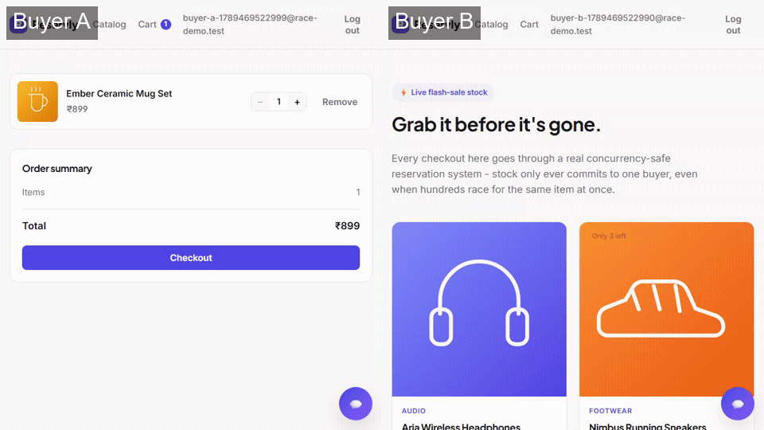

# Reservation System

A flash-sale/reservation checkout backend built to prove one thing under
real concurrent load: **when many buyers race for the same unit of stock,
exactly one of them gets it — never zero, never two — and the system stays
correct even when a dependency (Stripe, the DB, a worker process) fails
mid-transaction.**

The storefront (catalog, cart, checkout UI) is a thin demo surface. It
exists so the properties below are observable end-to-end, not because this
project is trying to be a general-purpose e-commerce app.

## The problem

Naive checkout code reads `product.stock`, checks `quantity <= stock`, then
writes `stock -= quantity` as two separate steps. Under concurrency, two
requests can both read the same stock value, both pass the check, and both
write — selling the same unit twice. The fix isn't "add a lock somewhere,"
it's choosing *which* lock, *where* it sits relative to a cheap pre-check
that has to absorb a much larger number of doomed requests, and reasoning
explicitly about every place that lock can race against something else
(a TTL sweep, a webhook, a retried request).

## The properties, and how each is actually enforced

### 1. Concurrent overselling prevention

`begin_checkout()` does a cheap Redis read first (`stock:avail:<id>`) to
reject obviously-doomed requests without touching Postgres — this is what
lets the system absorb a thousand simultaneous requests for one unit of
stock without a thousand database transactions. Requests that pass then
enter a single `transaction.atomic()` block that does
`Product.objects.select_for_update()` and re-checks availability *under the
lock* before committing. Redis is a fast-reject cache; Postgres, via the row
lock, is the only thing that actually decides who wins.

Why a DB row lock instead of optimistic concurrency (compare-and-swap on a
version column)? Under a real burst, most requests are doomed — optimistic
locking would mean nearly every request except the winner has to detect its
own conflict, retry, and lose again, multiplying database load under
exactly the load pattern this needs to survive. A pessimistic lock rejects
the loser once, immediately, with an accurate answer.

**Proof:**
- [`apps/orders/tests/test_concurrency.py`](backend/apps/orders/tests/test_concurrency.py) —
  20 real threads, each with its own DB connection, racing `begin_checkout()`
  for the last unit of a product. Asserts exactly 1 success.
- [`load_test/locustfile.py`](load_test/locustfile.py) — the same race over
  real HTTP, at a larger scale. See **Load test results** below for actual
  numbers from a real run.
- Two independent, real browser sessions (own login, own cart, own session
  cookie) racing to check out the last unit of stock at the same instant —
  one wins, one is rejected in real time, no page refresh:

  

  Recorded by [`deploy/race_demo.mjs`](deploy/race_demo.mjs) against the real
  dev stack (not mocked) — signs up two real Firebase users, adds the same
  stock=1 product to two separate carts, and clicks Checkout on both at the
  same instant.

### 2. Reservation expiry (TTL)

A `Reservation` row is created alongside every pending order, separate from
`OrderItem` so the expiry sweep never touches permanent order-history rows.
A Celery beat task (`expire_reservations`, every 60s) finds `ACTIVE`
reservations past `expires_at` and fans out to a per-reservation task, so
one locked row can't stall the whole sweep.

The interesting part is the race against a concurrent webhook: `confirm_reservation()`
(the webhook path) locks `Reservation → Order`; the expiry task locks
`Reservation → Order → Product` (it alone needs the Product lock, since it's the
only one of the two that gives stock back). Same order on the two locks they
*do* share is what matters — a webhook confirming payment and the sweep
expiring it can never each hold one lock while waiting on the other. This
wasn't always true: an earlier version locked `Order → Reservation` on the
webhook side, and firing both paths at the same order at once reliably
produced a real Postgres `deadlock detected` (caught while writing this
README's own accuracy check, not in production). See
[`test_reservation_expiry.py`](backend/apps/orders/tests/test_reservation_expiry.py)
for the plain-expiry case, the "webhook already won" case, and
`test_webhook_and_expiry_race_on_the_same_order_without_deadlocking`, which
fires both concurrently via real threads and asserts neither blocks and the
result is always one consistent outcome.

### 3. Idempotent webhook handling

Stripe redelivers webhook events; processing one twice must never double-
charge or double-fulfill an order. The guarantee is a **database unique
constraint** on `StripeEvent.stripe_event_id`, not an application-level
`if exists()` check — a check-then-act pattern has its own race between two
concurrent deliveries. The claim-insert happens in its own transaction,
before any order mutation:

```python
try:
    with transaction.atomic():
        stripe_event = StripeEvent.objects.create(stripe_event_id=event["id"], ...)
except IntegrityError:
    return Response(status=200)  # already claimed - ack, don't reprocess
```

See [`test_webhook_idempotency.py`](backend/apps/orders/tests/test_webhook_idempotency.py).

### 4. Real-time order status

Every place that changes `Order.status` goes through one function,
`transition_order_status()` — never `order.status = X; order.save()`
inline. It no-ops on a non-transition and publishes over the WebSocket
channel layer inside `transaction.on_commit(...)`, so a rolled-back
transition is never announced and an unrelated field save (e.g. a total
recalculation) never fires a spurious push. This was a named anti-pattern
to avoid, not a hypothetical:
[`test_websocket_receives_push_only_on_genuine_status_transition`](backend/apps/realtime/tests.py)
asserts a client connected via WebSocket gets a push on a real transition
and *nothing* on an unrelated save to the same row.

### 5. Graceful failure handling

Two concrete failure modes, both with a reproduction test:

- **Stripe unreachable after the reservation committed.** `CheckoutView`
  calls Stripe through a real circuit breaker (closed/open/half-open, backed
  by Redis so every server process shares the same view of "is Stripe
  healthy"), not just a try/except with a timeout. After 5 straight
  failures it stops even attempting the call for 30 seconds and returns
  `502` immediately — the difference that actually matters: a plain
  try/except still calls Stripe on every single request, even during a
  known outage. See
  [`test_circuit_breaker.py`](backend/apps/orders/tests/test_circuit_breaker.py)
  and [`test_checkout_view.py`](backend/apps/orders/tests/test_checkout_view.py)
  (which proves the 6th request never touches Stripe at all). Either way,
  the reservation itself is untouched, not lost or double-created.
- **A worker crashes between claiming a webhook event and finishing its
  effect.** Because the claim-insert and the mutation are separate
  transactions, a crash there leaves a `StripeEvent` row with
  `processed_at IS NULL` — durable proof the event was seen, but not yet
  fully applied. A beat task, `sweep_unprocessed_stripe_events`, finds rows
  like that after 2 minutes and replays them; replay is safe because the
  mutation logic checks current state before acting. See
  [`test_sweep_recovers_event_claimed_but_never_processed`](backend/apps/orders/tests/test_webhook_idempotency.py).

### 6. Checkout idempotency (not just the webhook)

The Stripe webhook's idempotency (property 3) only protects against Stripe
redelivering the *same* event twice. It says nothing about a client retrying
the *original* `POST /checkout/` — a flaky network, a double-click that
slips past the disabled button, a proxy replaying a POST it never got a
response for. Each of those is a fresh HTTP request with no shared event ID
to dedupe on, so it needs its own guarantee: a client-generated
`Idempotency-Key` header, claimed via the same DB-unique-constraint pattern
as the webhook (`CheckoutIdempotencyKey`, unique on `(user, key)`). The
claiming insert happens *before* `begin_checkout()` ever reserves stock, so
a losing concurrent request with the same key is rejected before it
reserves anything — there's no reservation to clean up on the losing side.
A retry after a real failure (out of stock) releases the key, so it doesn't
permanently block a legitimate second attempt. See
[`test_checkout_idempotency.py`](backend/apps/orders/tests/test_checkout_idempotency.py),
including a 10-thread proof that a shared key across concurrent requests
still produces exactly one order.

### 7. Event-driven order processing — scoped to what's safe to decouple

CLAUDE.md's original description of this pattern includes inventory
deduction as one of the decoupled consumers. Deliberately *not* implemented
that way: inventory deduction already happens synchronously inside
`confirm_reservation()`'s locked transaction, and moving it to an async
consumer would mean a request could return "paid" before stock is actually
decremented — reopening the exact overselling race property 1 exists to
close. Only the two side effects that aren't correctness-critical to the
stock guarantee are event consumers: a confirmation email and a fulfillment
simulation. `dispatch_order_placed()` fires once, after commit, and makes
two independent `.delay()` calls — not one task invoking the other, which
is what actually guarantees a broken email provider can never block or fail
fulfillment. Verified live with a real Celery worker: a real "paid" event
produced a rendered confirmation email and a
`paid → processing → shipped → delivered` status trail with the later
steps genuinely 8 seconds apart. See
[`test_event_driven_processing.py`](backend/apps/orders/tests/test_event_driven_processing.py).

## Known limitation: Redis/Postgres drift

The Redis availability cache is a write-through cache updated after every
successful reservation and every expiry — it is deliberately never the
source of truth (Postgres, behind the row lock, is). If Redis restarts and
loses its keys, the pre-check just always passes through to Postgres until
it's repopulated - slower, but never wrong. The load test in this repo
independently rediscovered the opposite failure mode during development: a
**stale** Redis key from a previous run is a real hazard, since nothing
currently reconciles it against Postgres proactively. `seed_load_test`
writes the correct key on reseed to work around this for testing; a
production deployment would want either a short TTL on the cache key or an
explicit reconciliation job. This is tracked as a known gap, not silently
worked around.

## Architecture

```
backend/
  config/          Django project (settings, urls, asgi/wsgi, celery.py)
  apps/
    accounts/      Firebase ID-token verification -> User -> SimpleJWT (rotation + blacklist)
    catalog/       Product, Category - descriptive fields + stock/reserved counters
    orders/        Order, OrderItem, Reservation, StripeEvent, OrderStatusEvent,
                    CheckoutIdempotencyKey. OWNS all stock mutation, checkout,
                    payment, webhook, TTL-expiry logic
    realtime/      Channels consumer + publish() helper, no models
    storefront/    Thin session-backed cart, calls apps.orders.services only
    assistant/     RAG product search + Gemini function-calling chat
frontend/          React (Vite) - catalog, cart, checkout, live order status,
                    Firebase login, a floating shopping-assistant widget
load_test/         Locust script + JWT-seeding management command
```

One app owns the transactional core (`orders`) instead of order logic being
smeared across a cart app, a storefront app, and an orders app with no
single source of truth for what "the order" even is. Stock is only ever
mutated inside `apps/orders/services.py`; nothing else writes to
`Product.stock`/`reserved` directly, including the cart, which is a plain
`{product_id: qty}` structure in the session — not a DB model, so it can't
grow its own competing notion of a pending order.

## AI layer: RAG product search + real function calling

A floating shopping-assistant widget, backed by Gemini, with three tools it
can actually call against live backend logic — not a search box with an LLM
wrapper glued on:

- **`search_products`** — the RAG piece. Each product's name/category/
  description is embedded once (Gemini's embedding model, 768 dims, stored
  in Postgres via `pgvector` with an HNSW index) and a query is embedded the
  same way at request time, matched by cosine distance. Verified this
  actually captures meaning, not just keywords: "something for a morning
  run" correctly surfaces the running shoes, "carry my laptop to work"
  surfaces the backpack, neither query using the product's literal name.
- **`add_to_cart`** — calls the exact same `apps.storefront.cart` functions
  the regular cart UI uses. The model never touches session state directly.
- **`get_order_status`** — scoped strictly to the requesting user
  (`Order.objects.get(pk=order_id, user=user)`, never trusts the ID alone).
  An unauthenticated request for someone else's order gets a clean refusal,
  not the order's data.

`apps/assistant/chat.py` runs a manual function-calling loop (detect a
function call in Gemini's response, run the real tool, feed the result back,
repeat) rather than the SDK's automatic-function-calling helper, so the
exact request/response at each turn stays inspectable. It also degrades
gracefully on a Gemini API error (quota exhaustion, an outage) instead of
500ing — the assistant is a layer on top of a working store, not something
checkout depends on, the same "graceful degradation over a dependency
outage" pattern used for Stripe.

Model choice was verified live, not assumed from training-data-era names:
`gemini-2.5-flash` turned out to be retired for new users, and the
full-size `gemini-3.6-flash` has a 20-request/day free-tier quota that live
testing burned through in minutes — `gemini-flash-lite-latest` is the
default for a much higher free-tier ceiling at more than enough quality for
short tool-calling replies.

## Running it

```bash
docker compose up -d                       # Postgres (pgvector) + Redis
cd backend
python -m venv .venv && .venv/Scripts/pip install -r requirements.txt
cp .env.example .env                       # fill in Firebase/Stripe/Gemini keys for the full flow
python manage.py migrate
python manage.py seed_demo_products        # catalog with icon art + INR pricing
python manage.py backfill_embeddings       # needs GEMINI_API_KEY - powers the AI search
python manage.py runserver

# in another terminal - runs reservation-expiry, the webhook recovery
# sweep, and the confirmation-email/fulfillment consumers.
# --pool=solo is a Windows-only requirement; drop it on Linux/macOS.
celery -A config worker --pool=solo --loglevel=info

cd ../frontend
npm install
cp .env.example .env
npm run dev
```

Run the test suite (the actual proof, not just descriptions of it):

```bash
cd backend
python -m pytest apps/ -v
```

## Load test results

Setup and full explanation: [`load_test/locustfile.py`](load_test/locustfile.py).

```
python manage.py seed_load_test --users 150 --stock 1
locust -f load_test/locustfile.py --host http://localhost:8000 --headless -u 150 -r 150 --run-time 15s
```

Real output from a run against this codebase (Windows dev machine, single
`daphne` process, local Postgres/Redis in Docker — not a production
deployment, see note below):

```
Type     Name                  # reqs  # fails |  Avg    Min    Max    Med  | req/s  fails/s
POST     /api/cart/items/         199     4    | 6095   3532  11520  4900  | 15.2    0.31
POST     /api/checkout/           114     4    | 4253   3065   7474  4200  |  8.7    0.31
         Aggregated               313     8    | 5424   3065  11520  4400  | 23.9    0.61
```

Verified directly against the database after the run (the number that
actually matters — not the HTTP status codes, which can be dropped by an
overwhelmed local dev connection, but what got durably written):

```
product stock=1 reserved=1 available=0
orders created: 1          (against 150 concurrent buyers racing for it)
order status: {'pending_payment': 1}
reservation status: {'active': 1}
```

**Exactly one order, out of 150 concurrent attempts, holding exactly one
unit of stock.** No overselling, no lost reservation, checked at the source
of truth rather than trusting client-visible response codes.

**Why this run is capped at 150 concurrent users, not 500+:** an earlier
500-user run against a single `daphne` dev process on this Windows machine
hit two capacity ceilings that are properties of the local test rig, not
the application: Postgres' default `max_connections=100` (raised to 600 in
`docker-compose.yml` for this repo, since the app opens one connection per
request with no pooling in front) and Windows' TCP connection backlog
rejecting a fraction of simultaneous connection attempts outright
(`ConnectionRefusedError`, never reaching Django at all). Both are solved
in a real deployment by running multiple `daphne`/Gunicorn workers behind
nginx with OS-level tuning — see `docker-compose.prod.yml` — not by
changing the locking strategy, which doesn't get weaker at higher scale:
the row lock in `begin_checkout()` serializes exactly the concurrent
requests for the *same product row* no matter how many there are.
[`test_concurrency.py`](backend/apps/orders/tests/test_concurrency.py) is
the scale-independent proof of the locking property itself, run in-process
against real threads and a real Postgres transaction, with no HTTP or OS
layer in between to introduce capacity artifacts.

## Deployment

`docker-compose.prod.yml` runs `web` (daphne, serves both HTTP and
WebSocket), `celery_worker`, `celery_beat`, `postgres`, `redis`, `frontend`
(nginx serving the built SPA), and a top-level `nginx` reverse proxy that
routes `/api/`, `/admin/`, `/static/`, and `/ws/` to `web` and everything
else to `frontend`. Secrets come from `backend/.env` (never committed) and
the Firebase service-account JSON is mounted from a volume populated out of
band — never baked into an image layer or committed to this repo.
